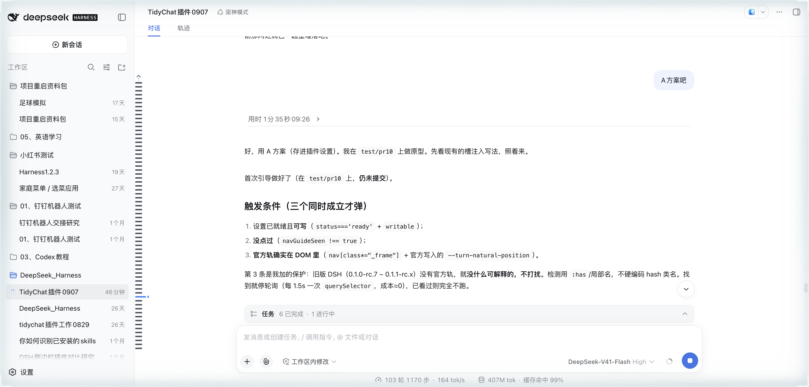
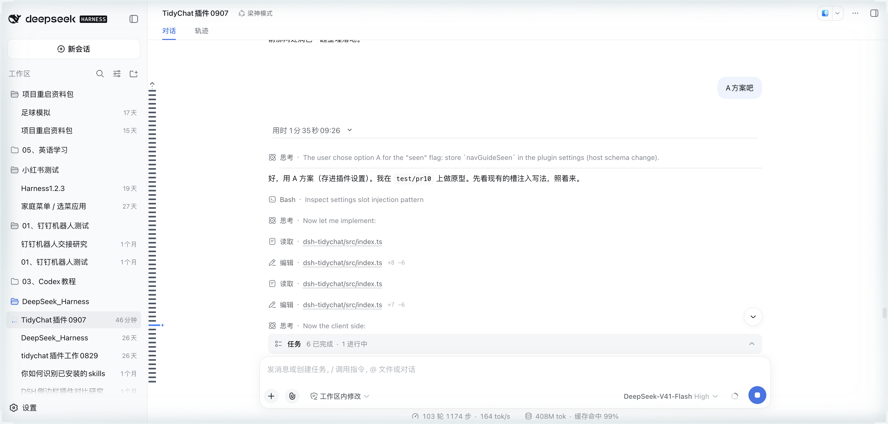
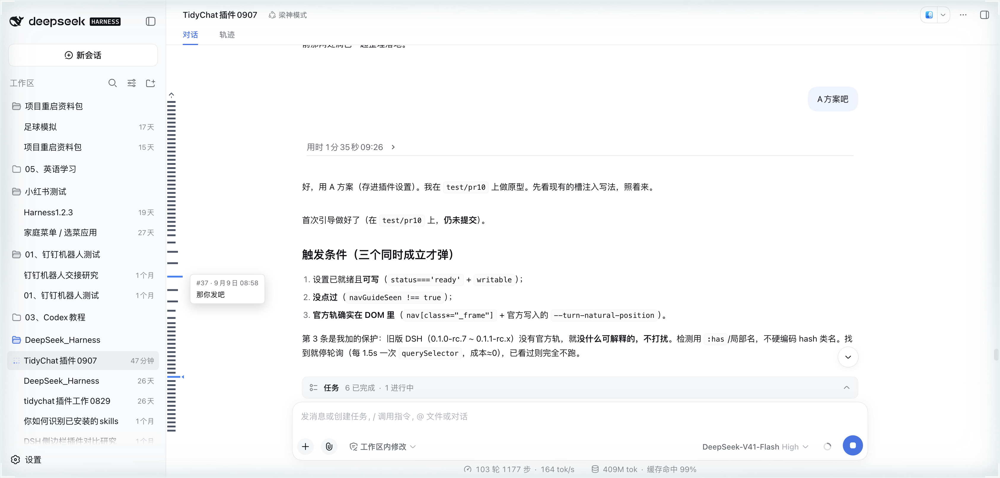

# dsh-tidychat

> [中文](./README.md)

> **▼ DSH version compatibility**
> | DSH version | settings registration | Fold / divider / auto-load | Left rail |
> | --- | --- | --- | --- |
> | 0.1.0-rc.7 / 0.1.1-rc.x | `register` | ✅ works | ⛔ paused since 0.2.6 |
> | 0.1.2-alpha.2+ / 0.1.2-rc.1 | `installSection` | ✅ works | ⛔ paused since 0.2.6 |
>
> - **Settings auto-adapts**: the plugin picks the registration API per host version — `installSection` on 0.1.2+, `register` on 0.1.0-rc.7 / 0.1.1-rc.x — so the same plugin loads and registers its toggles across **DSH 0.1.0-rc.7 → 0.1.2-rc.1**.
> - **Feature overlap**: since DSH 0.1.2 the host natively folds process content + System prompt and adds a right-edge TurnNavigator, overlapping the plugin's fold / left-edge rail.
> - **Usage recommendation**:
>   - **DSH 0.1.2+**: pick one with the native fold — if you use the native fold, disable the plugin's fold (avoid double-folding); if you want the plugin's fold control bar, disable the native fold.
>   - **DSH ≤ 0.1.1-rc.x**: fold / divider / smart auto-load work normally; the left rail is likewise paused (disabled since 0.2.6).
> - **Left rail paused**: the left-edge rail is **not shown** since 0.2.6, for two reasons: it overlaps the **right-edge TurnNavigator / native fold** that the host added in DSH 0.1.2, and its implementation depends on **`react-dom`** (not provided by the plugin or host). Whether to keep it, or rework it to work with the official navigator/fold, is **deferred to a future version** (source and historical screenshots retained).

Turn long DSH conversations into a **scannable, skippable** stream of conclusions.

In multi-task sessions, thoughts, tool calls, intermediate text and final summaries pile up, making it hard to find "the conclusion of that last task". dsh-tidychat automatically folds completed turns into a single conclusion line and separates thinking from prose with a divider; the original Codex-style navigation rail (Canvas minimap) on the left edge is **paused since 0.2.6** because it conflicts with the official new feature and has a `react-dom` dependency issue — keep/rework is left to a future version.

> 🔌 Ecosystem: tagged `#dsh` · `#dsh-plugin`, contributions welcome.

## ✨ Features

| Feature | Description |
| --- | --- |
| 🗂 Auto-fold | Completed turns fold away thinking (Think), tool calls and intermediate text, keeping only the final summary; the control bar shows "N steps" and timing (duration / first token / rate) |
| ➖ Divider | A solid line between thinking and prose — one glance separates "process" from "conclusion" |
| 📍 Left-edge Navigation Rail (Adaptive) | **Paused since 0.2.6** (conflicts with the official new feature + `react-dom` issue; keep/rework TBD). Historical capability: fixed-height Canvas minimap mapping any turn count; fish-eye hover, drag preview, click-to-jump, current-turn highlight; color auto-adapts or manual `hue × lightness`, accent independently configurable |
| ⬆ Smart earlier-history load | Gradually loads older records while the page is idle; pauses automatically when the page's responsiveness drops, keeping long sessions smooth; manual load still available |
| 📤 One-click issue report | Generates a diagnostic report (version / browser / performance / anomaly detection / symptom tags) and opens a pre-filled GitHub issue — title and body included, zero manual writing |

Fold / divider / smart early-history load are independent toggles in "Settings → Plugin Configuration", applied instantly; the left-edge rail is **paused since 0.2.6** (official-feature conflict + `react-dom` issue). Also includes a one-click "Generate diagnostic report & submit" entry.

## 📸 Screenshots

**Auto-fold**: completed turns collapse to a control bar with only the final conclusion (top); click "expand" to restore thinking, tool calls and intermediate text (bottom).

<p align="center">
  
  
</p>

**Left-edge navigation rail (Canvas minimap)**: _paused since 0.2.6_ (official-feature conflict + `react-dom` issue; keep/rework TBD). The image below shows the historical version.

<p align="center">
  
</p>

**Settings panel**: four independent toggles + symptom tags + one-click "Generate diagnostic report & submit", applied instantly.

<p align="center">
  
</p>

## 🚀 Install

Prerequisite: DSH (Web) installed, `pnpm` on PATH.

```sh
# Option 1 (recommended): npm package, prebuilt — no allowBuilds approval needed
dsh plugin --profile web add @bananasoldier01/dsh-tidychat

# Option 2: from GitHub (pin a tag for reproducibility)
dsh plugin --profile web add git+https://github.com/BananaSoldier01/dsh-tidychat.git#v0.2.7
```

Restart dsh web + hard refresh (Cmd+Shift+R) after installing.

### Update

The plugin is installed as a profile dependency; updating just re-pulls that dependency (only this plugin, no full DSH re-download):

```sh
# Option A: npm-installed — update directly
dsh plugin --profile web update @bananasoldier01/dsh-tidychat

# Option B: pinned to a tag — re-add pinned to the new tag
dsh plugin --profile web add git+https://github.com/BananaSoldier01/dsh-tidychat.git#v0.2.7
```

Restart dsh web + hard refresh after updating.

> ⚠️ **Making settings writable (only DSH ≤ 0.1.0-rc.6)**: rc.6 and earlier hardcode the plugin-namespace whitelist in the host build, so third-party switches appear greyed out. Run this to add `tidychat` to the whitelist (idempotent; re-run after DSH upgrades):
>
> ```sh
> curl -sL https://raw.githubusercontent.com/BananaSoldier01/dsh-tidychat/main/scripts/whitelist-patch.sh | bash
> ```
>
> **Not needed for DSH ≥ 0.1.0-rc.7**: rc.7 removed the whitelist; namespaces register dynamically and switches work out of the box.

> 💡 **Compatibility**: `0.2.0`+ supports **DSH ≥ 0.1.0-rc.7** (incl. 0.1.1-rc.x; contract points verified on rc.1/rc.2). rc.7 changed `settings.plugin.item` from a list to keyed slots (`id` → `key`); the old form errors with "Failed to load plugins". Use **`0.1.0` for DSH ≤ 0.1.0-rc.6**.

## 🗺️ Roadmap

### 0.2.0 (released) — Adaptive Conversation Navigation Rail

The rail upgraded from a fixed list to a **Canvas-minimap global navigator**:

1. **Fixed height**: `min(70vh, 660px)` — any turn count (20/70/200+) maps into the same viewport
2. **Uniform global mapping**: `y = index/(total-1) × railHeight`, no DOM growth with turn count (1 canvas + 1 tip card)
3. **Fish-eye hover**: ±4 turns near the cursor zoom, distant ones compress; hit-testing and rendering share one layout function
4. **Drag scrubbing**: preview the target while dragging, jump on release
5. **Current-turn highlight**: anchored to the top of the reading area (incl. header offset), updated with scroll
6. **Precise jump**: user messages scroll to the top of the reading area (not viewport center, not buried in the header)
7. **Compatibility**: fold / divider / autoload / diagnostics unaffected (rail data comes from the session snapshot, independent of fold CSS hiding)

### 0.2.1 (released) — Rail color polish (PR #5 merged)

1. **True background bubbling**: auto color walks up the parent chain from the scroll container for the first non-transparent background (alpha=0 skipped), instead of a fixed candidate set
2. **Auto respects the theme**: default auto uses the host's muted label color when its contrast vs the real background is ≥3:1, else a corrective gray; accent auto (default) = theme brand color (`--dsw-alias-state-business-primary`)
3. **Colors collapsed as an "advanced" section** in settings; lightness tier disabled while auto
4. **Enumerated config**: the four color fields are `z.union` enums; temporary `:root` variables cleaned on unload

### 0.2.2 (released) — Tooltip readability (issue #6)

1. **Head tier lift**: tooltip `#num · time` from the weakest tier (`label-tertiary`) to `label-secondary`, no longer washed out on light backgrounds; body follows `label-primary` (same color as conversation text), auto light/dark
2. **Conservative contrast fallback**: only when the tooltip backdrop is opaque (`bg-layer-3` alpha ≥ 0.85) and label tokens contrast <3:1 does it write a corrective color (dark text on light, light on dark); glassy/translucent backdrops (official dark mode etc.) always skip and follow theme tokens — no misjudging dark glass
3. **Long summaries wrap**: `overflow-wrap: anywhere` keeps long code/URLs inside the card
4. **Parser hardening**: color parsing supports `rgba` comma / space+slash syntax, `#rgb/#rgba/#rrggbb/#rrggbbaa`, `transparent`

### 0.2.3 (released) — npm publishing (awesome-dsh-plugin recommended items)

1. **peerDependencies**: `@deepseek-ai/dsh-settings` moved from `dependencies` to `peerDependencies` (host-provided runtime, no duplicate runtimes in the profile)
2. **npm publish**: `prepublishOnly` auto-builds; `@bananasoldier01/dsh-tidychat@0.2.3` is public (prebuilt — install skips `allowBuilds`); recommended install is now `dsh plugin add @bananasoldier01/dsh-tidychat`
3. **Listing**: awesome-dsh-plugin submission PR submitted (#3067, session category + screenshots), awaiting maintainer merge

### 0.2.4 (released) — npm package metadata refresh

No functional changes — npm package content only: `README.en.md` bundled, `repository.url` normalized (`npm pkg fix`), bilingual README shipped. The awesome-dsh-plugin listing PR #3067 has merged (session category + screenshots).

### 0.2.5 (released) — Hardening

1. **Fold-state session isolation (P0)**: `foldState` now `Map<sessionId, Map<turn, boolean>>` — fixes cross-session bleed (expanding turn 5 in session A no longer leaves session B's turn 5 unexpectedly expanded)
2. **Pointermove throttling**: high-frequency moves record the latest coordinates and process once per frame via rAF (no more React render per event); pending frames cancelled on leave/unmount
3. **No render before measurement**: when host layout is not ready (`pos === null`), the rail no longer renders at the hardcoded 280px guess position — it appears once measurement succeeds
4. **Snapshot/DOM turn-consistency check**: the report now compares session-snapshot turns with DOM turns and flags mismatches (loading or DOM lag)
5. Version pins updated; package description now lists all four features

### 0.2.6 (released) — Fold & divider redo; left rail paused

1. **Fold redo (Codex-style)**: only folds thinking (Think) + tool calls, keeping the user message and the final formal reply; the control bar is "duration X + arrow + divider", whole bar clickable, arrow points right when folded and down when expanded; a separate divider is drawn between process and reply.
2. **Divider redo**: the process/reply boundary now uses an inline divider (drawn via the thinking chip's `::after`, survives React re-renders) and is darkened to `rgba(96,96,96,0.85)` for better contrast.
3. **⚠️ Left rail paused**: since DSH 0.1.2-rc.1 the host natively adds a right-edge TurnNavigator and native fold, overlapping the plugin's left rail; the rail also depends on `react-dom` (not provided by the plugin or host). So from this version the **left-edge rail is not shown**. Whether to keep it, or rework it to work with the official navigator/fold, is deferred to a future version (source and historical screenshots retained).
4. **Fold retry notices too (issue #8)**: the host renders a retried model request as a `model-retry` row ("已重试模型请求"), which was not folded before. Since this version `model-retry` is treated as process noise and folded together with thinking/tool calls.

### 0.2.7 (released, current) — Settings API backward compatibility

1. **Settings registration auto-adapts**: the host chooses the right API per DSH version — `installSection` on 0.1.2+, `register` on 0.1.0-rc.7 / 0.1.1-rc.x — so the same plugin loads and registers its settings toggles across **DSH 0.1.0-rc.7 → 0.1.2-rc.1** (0.2.6 relied on the 0.1.2 `installSection`, which made old DSH report "Failed to load plugins").
2. **Left rail**: still conflicts with the official feature and depends on `react-dom`; remains paused (this compatibility change does not restore it).

### Next (candidates)

1. **Turn Index layer** — conversation DOM → Turn Index (id/element/position/summary), shared by fold/navigator/autoload, replacing full rescans; incremental maintenance once real 500+/1000+ turn data is available.
2. **Folding completed in-flight steps** (issue #2) — within a single turn that runs many actions, fold completed steps live. Demand TBD.

### Local dev (link mode)

```sh
git clone https://github.com/BananaSoldier01/dsh-tidychat.git
cd dsh-tidychat
pnpm install
dsh plugin --profile web add link:$PWD
```

After editing: `pnpm run build`, then restart dsh web / hard refresh.

## ⚙️ Settings

Expand the **dsh-tidychat** card in "Settings → Plugin Configuration":

- **Auto-fold completed turns**: hides thinking, tool calls and intermediate text, keeps only the final conclusion; control bar shows timing.
- **Thinking ↔ text divider**: solid line between the thinking row and body text.
- **Left-edge navigation rail**: thin rail on the left edge; hover shows summary, click jumps to the message.
- **Smart earlier-history load**: gradually loads older records while idle; pauses when responsiveness drops; manual load remains available.
- **Colors (advanced, collapsible)**: two groups, each a `hue × lightness` orthogonal config. **Default color** auto = host muted label, corrective gray when contrast vs the chat background is insufficient (light on dark, dark on light); manual hues: gray/black/white/blue/violet/cyan/green/orange/red with lightness l1 (lightest) → l5 (deepest). **Accent** controls the current + hover/jump-target turn highlight; auto (default) = theme brand color (`--dsw-alias-state-business-primary`).

## 🔧 How it works

Pure browser half (`exports "./client"`); the host half only registers the settings namespace — no DSH source modifications:

- Fold / divider / navigation locate DOM via contract-level anchors (`data-chat-anchor-key`, `data-variant="think"`, etc.), not compile-time hashed class names;
- A `MutationObserver` watches the conversation DOM, with a periodic fallback scan, handling streaming renders and history loads;
- Fold state is in-memory per session — refresh resets to defaults (all folded).

## 🧑‍💻 Development

```sh
pnpm install
pnpm run build      # tsdown builds lib/
pnpm run typecheck
```

## 📄 License

MIT
