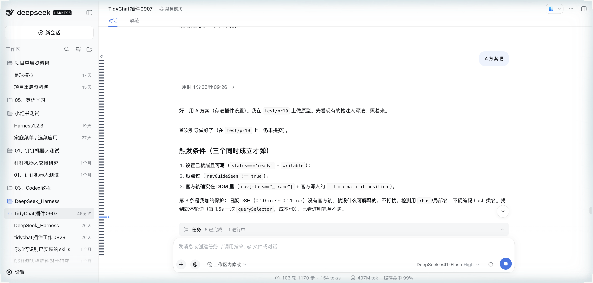
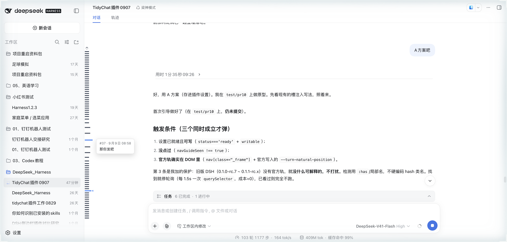
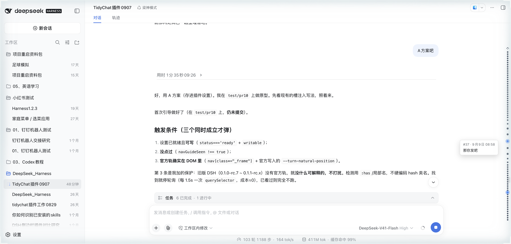

# dsh-tidychat

> [中文](./README.md)

> 🧩 A web plugin for [DeepSeek Harness](https://github.com/deepseek-ai/deepseek-harness) (`dsh`), listed in [awesome-dsh-plugin](https://github.com/awesome-dsh-plugin/awesome-dsh-plugin).

Turn long DSH conversations into a **scannable, skippable** stream of conclusions.

In multi-task sessions, thoughts, tool calls, intermediate text and final summaries pile up, making it hard to find "the conclusion of that last task". dsh-tidychat folds completed turns into a single conclusion line, separates thinking from prose with a divider, and adds a Codex-style navigation rail (Canvas minimap) along the chat edge.

## ✨ Features

| Feature | Description |
| --- | --- |
| 🗂 Auto-fold | Completed turns fold away thinking (Think), tool calls and intermediate text, keeping only the final summary; the control bar shows "N steps" and timing |
| ➖ Divider | A solid line between thinking and prose — one glance separates "process" from "conclusion" |
| 📍 Navigation rail | Global navigation along the chat edge: fish-eye hover, drag preview, click-to-jump, current-turn highlight. Dockable **left or right** (right mirrors everything), styles **line / dot**, plus a separate **ring** toggle; colours auto-adapt or come from a colour picker. When earlier history is not loaded yet, an arrow appears at the rail's top — click it to load |
| 🎛 Take over the official rail | Hides DSH 0.1.2+'s native right-edge TurnNavigator so this plugin's rail takes over (off by default; hides rather than unmounts) |
| ⬆ Smart earlier-history load | Gradually loads older records while idle; pauses automatically when responsiveness drops; manual load still available |
| 📤 One-click issue report | Generates a diagnostic report (version / browser / performance / anomaly detection / symptom tags) and opens a pre-filled GitHub issue |

All five toggles are independent ("Settings → Plugin Configuration", applied instantly). On DSH 0.1.2+, the first time both rails are present a one-time guide explains "left = this plugin / right = official DSH" and offers three one-click choices.

## 📸 Screenshots

**Auto-fold**: completed turns collapse to a control bar with only the final conclusion (top); click "expand" to restore thinking, tool calls and intermediate text (bottom).

<p align="center">
  
  
</p>

**Navigation rail**: dockable left or right, style line / dot, ring independently toggleable. Hovering shows that turn's summary; clicking jumps to it.

<p align="center">
  
  
</p>

**When earlier history is not loaded** (turns above are not mounted yet — common right after opening a long session): an arrow and a dashed line appear at the top of the rail; hovering explains the current coverage and **clicking loads earlier records**.

<p align="center">
  
</p>

**Settings card**: five toggles (fold / divider / rail / take over the official rail / smart earlier-history load) + the rail's position · style · ring + colors + symptom tags and one-click diagnostics.

<p align="center">
  
</p>

## 🚀 Install

Prerequisite: DSH (Web) installed, `pnpm` on PATH.

```sh
# Option 1 (recommended): npm package, prebuilt — no allowBuilds approval needed
dsh plugin --profile web add @drscrewdriver/dsh-tidychat

# Option 2: from GitHub (pin a tag for reproducibility)
dsh plugin --profile web add git+https://github.com/drscrewdriver/dsh-tidychat.git#v0.3.4
```

Restart dsh web + hard refresh (Cmd+Shift+R) after installing.

### Update

The plugin is installed as a profile dependency; updating just re-pulls that dependency (only this plugin, no full DSH re-download):

```sh
# Option A: npm-installed — update directly
dsh plugin --profile web update @drscrewdriver/dsh-tidychat

# Option B: pinned to a tag — re-add pinned to the new tag
dsh plugin --profile web add git+https://github.com/drscrewdriver/dsh-tidychat.git#v0.3.4
```

Restart dsh web + hard refresh after updating.

> ⚠️ **DSH ≤ 0.1.0-rc.6 only**: the host hardcodes its plugin-namespace whitelist, so third-party switches appear greyed out. Run `scripts/whitelist-patch.sh` once to add `tidychat` (idempotent; re-run after DSH upgrades):
>
> ```sh
> curl -sL https://raw.githubusercontent.com/BananaSoldier01/dsh-tidychat/main/scripts/whitelist-patch.sh | bash
> ```
>
> **Not needed on DSH ≥ 0.1.0-rc.7**: the whitelist was removed. Since `0.2.0` the plugin supports **DSH ≥ 0.1.0-rc.7** (rc.7 turned `settings.plugin.item` from a list into keyed slots — `id` → `key` — and the old form errors with "Failed to load plugins"); use plugin **`0.1.0` for DSH ≤ 0.1.0-rc.6**.
>
> **Since `0.3.2` the plugin targets DSH ≥ 0.1.7-rc.1** (declarative settings, see below; `.volatile()` does not exist on 0.1.6 or older hosts, where the plugin fails to load) — **use plugin `0.3.1` for DSH 0.1.0-rc.7 ~ 0.1.6**.

## 🧩 Compatibility

| DSH version | settings surface | Plugin line |
| --- | --- | --- |
| **0.1.7-rc.1+** | **Declarative**: Config `.volatile()` fields are auto-rendered as a form by the host — no registration calls | **✅ v0.3.4+**; the plugin's full settings card lives in its own tab of the "Plugins" settings section |
| 0.1.2-alpha.2+ ~ 0.1.6 | `installSection` (removed in 0.1.7) | ≤ v0.3.1 |
| 0.1.0-rc.7 ~ 0.1.2-alpha.1 | `register` (removed in 0.1.7) | ≤ v0.3.1 (fold / divider / auto-load since v0.2.8; rail **since 0.3.0** — on 0.2.10 and earlier the rail read the wrong snapshot, resolved 0 turns and never rendered) |

- **From v0.3.2 on, the old "pick the registration API per host version" fallback is no longer possible**: 0.1.7 removed `installSection` / `register` outright and replaced them with "the Config schema is the settings surface" (declarative). `.volatile()` is a 0.1.7-only method (it throws on older hosts), so the **0.1.7 line (v0.3.2+) and the legacy line (≤ v0.3.1) must ship separately** — one build cannot span both 0.1.6 and 0.1.7.
- Since DSH 0.1.2 the host natively folds process content and ships a right-edge TurnNavigator, overlapping the plugin's `fold` / rail: just **pick one** — if you use the native fold, disable the plugin's (avoid double-folding); if you want this plugin's own rail, turn on "Take over the official rail", otherwise you will see two rails, one on each edge.
- Takeover **hides rather than unmounts**: the host exposes no native switch, so with takeover on the official component stays mounted (its DOM remains) — what stops is painting, layout, interaction and scroll-following.

## ⚙️ Settings

v0.3.2 (DSH 0.1.7+) has two settings entries, both writing the same entry config and applying instantly:

- **Host auto-form**: basic toggles under "Settings → Plugin Configuration", auto-rendered from the Config `.volatile()` fields;
- **Full plugin settings card**: the **会话整理tidychat** tab in the "Settings → Plugins" section (includes the color pickers and the diagnostics entry).

Legacy hosts (≤ 0.1.6, plugin ≤ v0.3.1) only have the card in "Settings → Plugin Configuration". The items:

| Item | Config key | Default | Description |
| --- | --- | --- | --- |
| Auto-fold completed turns | `fold` | on | Hides thinking, tool calls and intermediate text, keeping only the final conclusion |
| Thinking ↔ text divider | `divider` | on | Inserts a solid line between the thinking row and body text |
| Rail | `navigator` | on | The thin navigator along the chat edge; **turning it off leaves no plugin rail at all** |
| Take over the official rail | `hideOfficialNav` | off | Hides DSH 0.1.2+'s native right-edge TurnNavigator; do not enable it while the rail itself is off |
| Smart earlier-history load | `autoLoad` | on | Loads older records while idle, pausing automatically when responsiveness drops |
| Position | `navSide` | left | `left` / `right` (right mirrors everything: bars grow leftward, the accent arrow points left, the hover card opens to the left) |
| Style | `navStyle` | line | `bar` line / `dot` dot; both keep the fish-eye zoom and click-to-jump |
| Ring | `navRing` | off | Translucent same-color halo around the current and hovered marks (stronger for current, softer for hover); a capsule for lines and a true circle for dots |
| Colors (advanced, collapsible) | `navColor` `navAccent` … | auto | Default color and accent each offer auto / custom. Auto: the default color uses the host muted label, switching to a corrective gray when contrast vs the chat background is insufficient; the accent follows the theme brand color. Custom: native picker (continuous) or an exact HEX / `rgb()` / `rgba()` value plus an alpha slider. The accent also drives the current/hover highlight and the ring halo |
| First-run guide | `navGuideSeen` | off | Shows a one-time guide when both rails are present; "Show the first-run guide again" recalls it any time |

> New defaults only affect fresh installs — existing installs keep the values already materialised in their settings, so a historical `navigator: false` must be turned on manually.

## 🔧 How it works

Pure browser half (`exports "./client"`); the host half only declares the Config schema (declarative since 0.1.7 — the volatile fields are the settings surface, no registration calls) — no DSH source modifications:

- Fold / divider / navigation locate DOM via contract-level anchors (`data-chat-anchor-key`, `data-variant="think"`, etc.), not compile-time hashed class names; a `MutationObserver` watches the conversation DOM with a periodic fallback scan, handling streaming renders and history loads.
- Fold state is in-memory per session — refresh resets to defaults (all folded).
- "Take over the official rail" also avoids build-time hashes: the official TurnNavigator's class names are CSS-module artifacts, so the plugin anchors on a **local-name substring + structure + the inline `--turn-natural-position` variable written for every turn**; turning it off simply removes the `data-tidychat-hide-official-nav` attribute from the root element.

## 🗺️ Roadmap

Per-version changes live in [`CHANGELOG.md`](./CHANGELOG.md). Currently 0.3.4; candidates:

1. **Turn Index layer**: conversation DOM → Turn Index (id/element/position/summary) shared by fold / navigator / autoload, replacing full rescans; incremental maintenance once real 500+ turn data is available.
2. **Folding completed in-flight steps** (issue #2): fold completed steps live within a single turn that runs many actions. Demand TBD.
3. **Upstream issue**: ask DSH to expose a switch (or slot override) for its native TurnNavigator so third-party plugins can truly "turn it off" instead of only hiding it.

## 🧑‍💻 Development

```sh
git clone https://github.com/BananaSoldier01/dsh-tidychat.git
cd dsh-tidychat && pnpm install
dsh plugin --profile web add link:$PWD   # link mode: pnpm run build, then restart dsh web / hard refresh
```

```sh
pnpm run build      # tsdown builds lib/
pnpm run typecheck
```

## 📄 License

MIT
