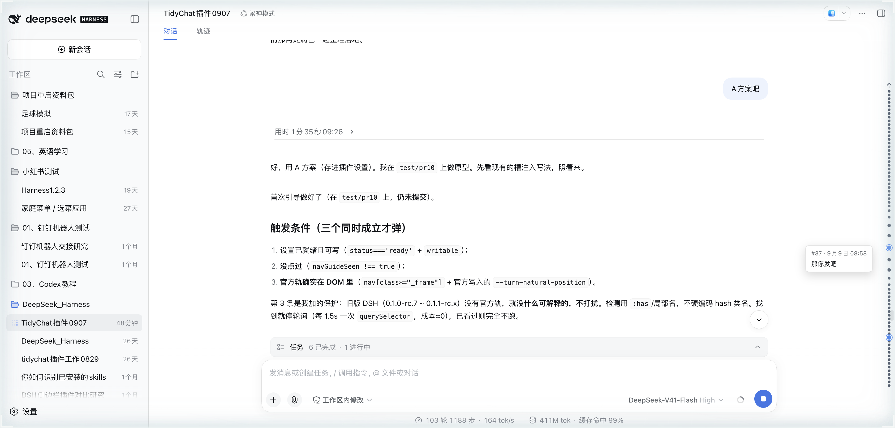
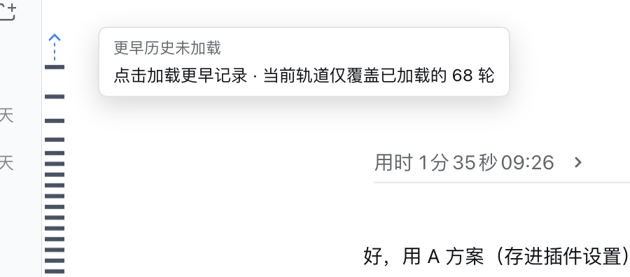

# dsh-tidychat

> 🌐 [English](./README.en.md)

> 🧩 [DeepSeek Harness](https://github.com/deepseek-ai/deepseek-harness)（`dsh`）Web 插件，已收录于社区列表 [awesome-dsh-plugin](https://github.com/awesome-dsh-plugin/awesome-dsh-plugin)。

让 DSH 的长会话变成**可扫读、可跳转**的结论流。

多任务、多轮次的会话里，思考、工具调用、中间文字和最终总结混在一起，回头找「上次那个任务的结论」很费劲。dsh-tidychat 把已完成的任务轮次自动折叠成一条结论，把思考与正文用分隔线切开；聊天区边缘的 Codex 式全局导航消息轨（Canvas minimap）可贴左缘或右缘，配合「接管官方消息轨」开关即可在 **DSH 0.1.2+** 上替代官方右缘 TurnNavigator（旧版 DSH 无官方轨，直接可用）。

## ✨ 功能

| 功能 | 说明 |
| --- | --- |
| 🗂 自动折叠 | 已完成轮次收起思考（Think）、工具调用与中间文字，只留最终总结；控制条含「过程 N 步」与处理时长 |
| ➖ 分隔线 | 思考行与正文之间的实线，一眼区分「过程」与「结论」 |
| 📍 消息轨 | 聊天区边缘的全局导航：鱼眼悬停、拖动预览、点击跳转、当前轮高亮。可贴**左缘或右缘**（右缘整体镜像），样式**横线 / 圆点**，另有独立**外圈**开关；配色自适应或调色盘自定义。更早历史未加载时，轨道顶部出现箭头提示，点击即加载 |
| 🎛 接管官方消息轨 | 隐藏 DSH 0.1.2+ 原生右缘 TurnNavigator，由本插件消息轨接管（默认关；是隐藏而非卸载） |
| ⬆ 智能加载更早历史 | 空闲时逐步加载更早记录，检测到响应下降自动暂停，需要时仍可手动继续 |
| 📤 一键报告问题 | 生成诊断报告（版本 / 浏览器 / 性能数据 / 异常检测 / 现象标签），一键打开预填好的 GitHub issue |

五项开关各自独立（「设置 → 插件配置」，改动即时生效）。在 DSH 0.1.2+ 上首次出现「插件轨 + 官方轨并存」时会弹一次向导讲清「左缘 = 插件 / 右缘 = 官方」，并可直接三选一。

## 📸 效果

**自动折叠**：已完成轮次收成一条控制条，只留最终结论（上）；点击「展开」恢复思考、工具调用与中间文字（下）。

<p align="center">
  
  
</p>

**消息轨**：可贴左缘或右缘，样式可选横线 / 圆点，外圈可独立开关。悬停显示该轮摘要，点击跳转。

<p align="center">
  
  
</p>

**更早历史未加载时**（上方还有未挂载的轮次，常见于刚打开长会话）：轨道顶部出现箭头 + 虚线，悬停说明当前覆盖范围，**点击即加载更早记录**。

<p align="center">
  
</p>

**设置卡片**：5 个开关（折叠 / 分隔线 / 定位条 / 接管官方消息轨 / 智能加载更早历史）+ 消息轨的显示位置 · 样式 · 外圈 + 配色 + 现象标签与一键诊断报告。

<p align="center">
  
</p>

## 🚀 安装

前置：已安装 DSH（Web 版），`pnpm` 在 PATH 上。

本仓库维护两条版本线，按你的 DSH 版本选：

| 线 | 分支 | 版本 | 面向的 DSH |
| --- | --- | --- | --- |
| **0.1.5 线（本页默认）** | `compat/0.1.5` | `0.3.1` | **0.1.5-alpha.1 及以上**（inject 用 `dsh-client-store`） |
| main 线 | `main` | `0.3.1` | 0.1.0-rc.7 ~ 0.1.2-rc.1 |

```sh
# 方式 1（推荐）：npm 包，预构建产物免 allowBuilds 授权
dsh plugin --profile web add @bananasoldier01/dsh-tidychat

# 方式 2：从 GitHub 安装（推荐钉版本，可复现）
dsh plugin --profile web add git+https://github.com/BananaSoldier01/dsh-tidychat.git#v0.3.1
```

安装后重启 dsh web + 硬刷新（Cmd+Shift+R）。

### 更新

插件以 profile 依赖的形式安装，更新就是让 pnpm 重新拉取该依赖的新版本（只拉这个插件，不会重下整个 DSH）：

```sh
# 方式 A：npm 方式安装，直接更新
dsh plugin --profile web update @bananasoldier01/dsh-tidychat

# 方式 B：装的是某个 tag，改钉到新 tag 重新 add
dsh plugin --profile web add git+https://github.com/BananaSoldier01/dsh-tidychat.git#v0.3.1
```

更新后同样重启 dsh web + 硬刷新。

> ⚠️ **仅 DSH ≤ 0.1.0-rc.6**：宿主白名单硬编码，第三方开关会变灰不可点，需跑一次 `scripts/whitelist-patch.sh` 把 `tidychat` 加进去（幂等，升级 DSH 后重跑）：
>
> ```sh
> curl -sL https://raw.githubusercontent.com/BananaSoldier01/dsh-tidychat/main/scripts/whitelist-patch.sh | bash
> ```
>
> **DSH ≥ 0.1.0-rc.7 不需要**：白名单机制已移除，命名空间由插件动态注册。`0.2.0` 起插件适配 **DSH ≥ 0.1.0-rc.7**（rc.7 把 `settings.plugin.item` 槽由 list 改为 keyed、注册字段由 `id` 改为 `key`，旧写法会报 "Failed to load plugins"）；**DSH ≤ 0.1.0-rc.6 请使用插件 `0.1.0`**。

## 🧩 兼容性

| DSH 版本 | settings 注册 | 折叠 / 分隔线 / 自动加载 | 消息轨 |
| --- | --- | --- | --- |
| **0.1.5-alpha.1+**（`compat/0.1.5` 线，0.3.1） | `installSection` | ✅ 可用 | ✅ 可用（「接管官方消息轨」开关控制官方轨；0.1.5 的 TurnNavigator 硬编码于 ChatView，隐藏选择器待实测） |
| 0.1.2-alpha.2+ ~ 0.1.2-rc.1 | `installSection` | ✅ 可用 | ✅ **0.3.0 起可用**（0.2.10 及更早取数路径读错快照，轨道解析出 0 轮、实际从未渲染） |
| 0.1.0-rc.7 ~ 0.1.1-rc.x | `register` | ✅ v0.2.8+ 可用（v0.2.7 无回退，不生效） | ✅ 可用（旧版无官方轨，不需要接管开关） |

- 插件按宿主版本自动选用注册 API，同一份产物在 **0.1.0-rc.7 ~ 0.1.2-rc.1** 都能加载并设置开关。
- **版本线说明**：`0.3.0` 起 inject 依赖由 `dsh-client-runtime`（0.1.2 起已移除，此前靠宿主 alias 兼容）切换为 `dsh-client-store`，**仅面向 DSH ≥ 0.1.5**；旧版本 DSH 请使用 main 线。
- DSH 0.1.2 起官方原生新增「折叠过程内容」与右缘 TurnNavigator，与插件 `fold` / 消息轨重叠，**二选一**即可：用官方的就关插件开关（避免双折叠），想用自己的轨就打开「接管官方消息轨」，否则会看到左右两条轨。
- 接管是**隐藏而非卸载**：宿主未提供原生开关，开启后官方组件仍会挂载（DOM 保留），停掉的是绘制、布局、交互与滚动跟随。

## ⚙️ 设置

在「设置 → 插件配置」展开 **会话整理tidychat** 卡片（改动即时生效）：

| 项 | 配置键 | 默认 | 说明 |
| --- | --- | --- | --- |
| 自动折叠已完成轮次 | `fold` | 开 | 隐藏思考、工具调用与中间文字，只保留最终结论 |
| 思考↔文字分隔线 | `divider` | 开 | 在思考行与正文之间插入实线 |
| 定位条 | `navigator` | 开 | 聊天区边缘的细窄条状导航；**关闭后没有任何插件轨** |
| 接管官方消息轨 | `hideOfficialNav` | 关 | 隐藏 DSH 0.1.2+ 原生右缘 TurnNavigator；定位条关闭时请勿开启 |
| 智能加载更早历史 | `autoLoad` | 开 | 空闲时逐步加载更早记录，响应下降自动暂停 |
| 显示位置 | `navSide` | 左缘 | `left` / `right`（右缘整体镜像：横线向左生长、强调三角指左、悬停摘要从鼠标左侧弹出） |
| 显示样式 | `navStyle` | 横线 | `bar` 横线 / `dot` 圆点，两者都保留鱼眼放大与点击跳转 |
| 外圈 | `navRing` | 关 | 当前轮与悬停轮的标记外描一圈强调色（1px、外扩 2px）；横线取胶囊形、圆点取正圆环 |
| 配色（高级，可折叠） | `navColor` `navAccent` 等 | 自动 | 默认色 / 强调色各自「自动 / 自定义」。自动：默认色用宿主淡色文字色，与聊天区背景对比不足时切纠偏灰，强调色跟随主题品牌色；自定义：原生取色器无极调色，或输入 HEX / `rgb()` / `rgba()` + 透明度滑杆。强调色同时决定当前轮 / 悬停轮高亮与外圈描边 |
| 首次引导 | `navGuideSeen` | 关 | 两轨并存时弹一次向导；卡片内「重新显示首次引导」可随时召回 |

> 默认值变更只影响新装——已装用户的旧默认值已物化在设置里，历史上的 `navigator: false` 需手动打开。

## 🔧 原理

纯浏览器半（`exports "./client"`）实现，host 半只注册 settings 命名空间，不修改任何 DSH 源码：

- 折叠 / 分隔 / 导航全部通过 DOM 结构锚点（`data-chat-anchor-key`、`data-variant="think"` 等契约级属性）定位，不依赖编译期 hash 类名；`MutationObserver` 观察会话 DOM，配合定时兜底扫描，处理流式渲染与历史加载。
- 展开 / 收起状态为会话内内存态，刷新后恢复默认（全部折叠）。
- 「接管官方消息轨」同样不依赖编译期 hash：官方 TurnNavigator 的类名是 CSS Module 产物，插件改用**局部名子串 + 结构 + 官方每轮必写的内联 `--turn-natural-position` 变量**三重锚定，关闭时仅移除根元素上的 `data-tidychat-hide-official-nav` 属性即可恢复。

## 🗺️ 路线图

逐版本变更已迁至 [`CHANGELOG.md`](./CHANGELOG.md)。当前 0.3.1，候选方向：

1. **Turn Index 层**：conversation DOM → Turn Index（id/element/position/summary），由 fold / navigator / autoload 共享，替代每次全量扫描；等真实 500+ 轮数据再定增量方案。
2. **运行中回合的已完成步骤折叠**（issue #2）：单轮内执行大量动作时实时折叠已完成步骤，需求强度待验证。
3. **向上游提 issue**：建议 DSH 为原生 TurnNavigator 提供开关（或槽位覆盖），让第三方插件能真正「逻辑关闭」而非仅隐藏。

## 🧑‍💻 开发

```sh
git clone https://github.com/BananaSoldier01/dsh-tidychat.git
cd dsh-tidychat && pnpm install
dsh plugin --profile web add link:$PWD   # link 模式：改源码后 pnpm run build，重启 dsh web / 硬刷新即生效
```

```sh
pnpm run build      # tsdown 构建 lib/
pnpm run typecheck
pnpm test           # 纯函数单测 + 构建产物契约断言
pnpm run lint       # eslint
```

## 📄 License

MIT
